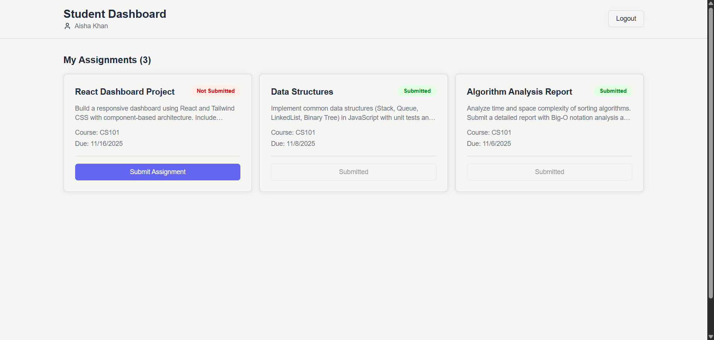
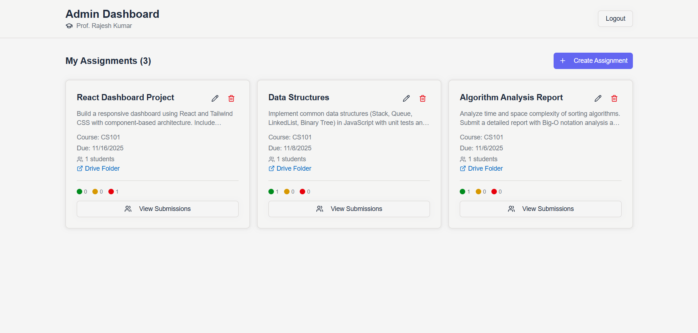

# Student Assignment Management System

A modern, responsive dashboard application for managing student assignments with role-based access for students and administrators. Built with React, TypeScript, and Tailwind CSS.

<div align="start">
  <table>
    <tr>
      <td width="50%">
        
        <p align="center"><b>Student Dashboard</b></p>
      </td>
      <td width="50%">
        
        <p align="center"><b>Admin Dashboard</b></p>
      </td>
    </tr>
  </table>
</div>

## 📋 Table of Contents

- [Setup Instructions](#setup-instructions)
- [Folder Structure Overview](#folder-structure-overview)
- [Component Structure & Design Decisions](#component-structure--design-decisions)

---

## 🚀 Setup Instructions

### Prerequisites

- **Node.js**: v18.x or higher
- **pnpm**: v8.x or higher (or use npm/yarn)

### Installation Steps

1. **Clone the repository**
   ```bash
   git clone <repository-url>
   cd joineazy-assignment
   ```

2. **Install dependencies**
   ```bash
   pnpm install
   ```

3. **Start development server**
   ```bash
   pnpm run dev
   ```
   The application will start at `http://localhost:5173`

4. **Build for production**
   ```bash
   pnpm run build
   ```

5. **Preview production build**
   ```bash
   pnpm run preview
   ```

### Login Credentials

The application uses simulated authentication with seed data:

- **Admin Login**: Click "Login as Admin"
  - User: Prof. Rajesh Kumar
  - Access: Create/Edit/Delete assignments, View student submissions

- **Student Login**: Click "Login as Student"
  - User: Aisha Khan (CS101)
  - Access: View assignments, Submit work with double-verification

---

## 📁 Folder Structure Overview

```
joineazy-assignment/
├── public/
│   └── seed.json                 # Initial seed data (users, assignments, submissions)
│
├── src/
│   ├── assets/                   # Static assets (images, icons)
│   │
│   ├── components/               # Reusable React components
│   │   ├── ui/                   # shadcn/ui components
│   │   │   ├── alert-dialog.tsx  # Confirmation dialogs
│   │   │   ├── button.tsx        # Button component
│   │   │   ├── card.tsx          # Card component
│   │   │   ├── dialog.tsx        # Modal dialog component
│   │   │   └── table.tsx         # Table component
│   │   │
│   │   ├── CreateAssignmentForm.tsx    # Admin: Create new assignment
│   │   ├── EditAssignmentForm.tsx      # Admin: Edit existing assignment
│   │   ├── Navbar.tsx                  # Global navigation bar
│   │   ├── SubmissionDialog.tsx        # Student: Double-verification submission flow
│   │   └── SubmissionsModal.tsx        # Admin: View all student submissions
│   │
│   ├── context/                  # React Context providers
│   │   └── AuthContext.tsx       # Authentication state management
│   │
│   ├── lib/                      # Utility libraries
│   │   └── utils.ts              # Helper functions (cn, etc.)
│   │
│   ├── pages/                    # Page-level components
│   │   ├── AdminDashboard.tsx    # Admin dashboard with assignment management
│   │   ├── LoginPage.tsx         # Role selection login page
│   │   └── StudentDashboard.tsx  # Student dashboard with assignment list
│   │
│   ├── services/                 # Business logic layer
│   │   └── dataService.ts        # localStorage API (CRUD operations)
│   │
│   ├── types/                    # TypeScript type definitions
│   │   └── index.ts              # Shared interfaces (User, Assignment, Submission)
│   │
│   ├── utils/                    # Utility functions
│   │   └── dataLoader.ts         # Data loading utilities for dashboards
│   │
│   ├── App.tsx                   # Main app component with routing
│   ├── App.css                   # Global styles
│   ├── main.tsx                  # Application entry point
│   └── index.css                 # Tailwind base + custom CSS variables
│
├── components.json               # shadcn/ui configuration
├── eslint.config.js              # ESLint configuration
├── tsconfig.json                 # TypeScript configuration
├── tailwind.config.js            # Tailwind CSS configuration
├── vite.config.ts                # Vite build configuration
└── package.json                  # Project dependencies
```

### Key Directory Purposes

- **`/components`**: Reusable UI components and feature-specific components
- **`/pages`**: Top-level route components (dashboards, login)
- **`/services`**: Data access layer abstracting localStorage operations
- **`/context`**: Global state management using React Context API
- **`/types`**: TypeScript interfaces ensuring type safety
- **`/utils`**: Helper functions and shared utilities
- **`/components/ui`**: shadcn/ui component library for consistent design

---

## 🏗️ Component Structure & Design Decisions

### Architecture Overview

The application follows a **component-based architecture** with clear separation of concerns:

```
┌─────────────────────────────────────────┐
│           Presentation Layer            │
│  (Pages, Components, UI Components)     │
├─────────────────────────────────────────┤
│          State Management Layer         │
│        (Context API, Hooks)             │
├─────────────────────────────────────────┤
│          Business Logic Layer           │
│     (Services, Utils, Data Loaders)     │
├─────────────────────────────────────────┤
│           Data Storage Layer            │
│           (localStorage API)            │
└─────────────────────────────────────────┘
```

### Core Design Patterns

#### 1. **Functional Programming Approach**
- **Zero classes**: All components and services use functional programming
- **Pure functions**: Stateless utility functions for predictability
- **Hooks-based**: React Hooks for state and side effects
- **Why?**: Better testability, clearer data flow, modern React best practices

#### 2. **Role-Based Access Control (RBAC)**
```typescript
// AuthContext provides currentUser
// Routes conditionally render based on role
{currentUser.role === "admin" ? <AdminDashboard /> : <StudentDashboard />}
```

#### 3. **Service Layer Pattern**
```typescript
// dataService.ts - Single source of truth for data operations
export function getAssignmentsByClass(className: string): Assignment[]
export function createSubmission(submission: Submission): void
export function updateAssignment(id: string, updates: Partial<Assignment>): void
```
- **Benefits**: Decoupled data access, easy to swap localStorage with API, testable

#### 4. **Progressive Disclosure**
- **Compact cards** → **Detailed modals**: Assignment cards show summary, modals show full details
- **Two-step submission**: Student declares → Student confirms (prevents accidents)
- **Why?**: Reduces cognitive load, scalable UI for many students/assignments

### Key Components

#### **Authentication Flow**
```
LoginPage → AuthContext.login(role) → Dashboard (role-based)
```
- Simulated authentication (no backend required)
- Persists user in localStorage
- Context API broadcasts auth state globally

#### **Student Dashboard**
```typescript
// Grid layout with responsive breakpoints
<div className="grid grid-cols-1 md:grid-cols-2 lg:grid-cols-3">
  {assignments.map(assignment => (
    <AssignmentCard 
      status={submission?.status || "not_submitted"}
      onSubmit={() => openDialog(assignment.id)}
    />
  ))}
</div>
```

**Three-State Status System:**
1. **Not Submitted** (Red): No action taken
2. **Submitted** (Yellow): Declared but not confirmed
3. **Confirmed** (Green): Final submission complete

**Double Verification Flow:**
```
Click Submit → Check box "I uploaded" → Declare Submission (AlertDialog)
→ Status: Submitted → Click Confirm → Final Confirmation (AlertDialog)
→ Status: Confirmed (Immutable)
```

#### **Admin Dashboard**
```typescript
// Grid layout for assignment cards
// Each card has: Edit, Delete, View Submissions actions
<AssignmentCard>
  <EditButton onClick={() => openEditModal(assignment)} />
  <DeleteButton onClick={() => confirmDelete(assignment.id)} />
  <ViewSubmissionsButton onClick={() => openModal(assignment)} />
</AssignmentCard>
```

**Submissions Modal:**
- Full-screen table (90vh x 90vw)
- Columns: Student Name, Progress Bar, Status, Submitted On
- Shows all students in course (even without submissions)
- Real-time progress tracking

#### **Form Components**
- **CreateAssignmentForm**: Modal dialog with validation
- **EditAssignmentForm**: Pre-filled form with `useEffect` to sync data
- **Shared validation logic**: URL validation, required field checks
- **Why modals?**: Non-intrusive, focused interaction, mobile-friendly

### State Management Strategy

#### **Local State (useState)**
```typescript
// Component-specific UI state
const [isDialogOpen, setIsDialogOpen] = useState(false);
const [selectedAssignment, setSelectedAssignment] = useState<Assignment | null>(null);
```

#### **Global State (Context API)**
```typescript
// Authentication state shared across app
const { currentUser, login, logout } = useAuth();
```

#### **Data Fetching Pattern**
```typescript
// Centralized data loading utilities
const loadData = () => {
  if (currentUser) {
    const data = loadAdminData(currentUser.id);
    setAssignments(data.assignments);
    setStudents(data.students);
  }
};

useEffect(() => {
  loadData();
}, [currentUser]);
```

### Styling & Theming

#### **CSS Variable System**
```css
/* index.css - Easy theme customization */
--status-success: oklch(0.65 0.15 145);
--status-warning: oklch(0.75 0.15 85);
--status-error: oklch(0.65 0.20 25);
--link: oklch(0.55 0.20 250);
```

**Benefits:**
- One place to change colors (light/dark mode ready)
- Consistent design tokens
- Perceptually uniform colors (OKLCH)

#### **Tailwind CSS Integration**
```typescript
// Utility-first with custom variables
className="text-status-error bg-status-error-bg"
className="grid grid-cols-1 md:grid-cols-2 lg:grid-cols-3 gap-4"
```

#### **shadcn/ui Components**
- **Installed components**: button, card, dialog, alert-dialog, table
- **Why shadcn?**: Copy-paste components, full customization, no dependencies
- **Tailwind-native**: Perfect integration with utility classes

### Data Flow Architecture

#### **Create Assignment Flow**
```
Admin clicks "Create Assignment"
  ↓
CreateAssignmentForm modal opens
  ↓
Admin fills form + validates
  ↓
dataService.createAssignment(newAssignment)
  ↓
localStorage.setItem('assignments', [...])
  ↓
loadData() refreshes dashboard
  ↓
New assignment card appears
```

#### **Student Submission Flow**
```
Student clicks "Submit Assignment"
  ↓
SubmissionDialog checks if submission exists
  ↓
If not exists: dataService.createSubmission()
  ↓
Student checks "I uploaded" checkbox
  ↓
Clicks "Declare Submission" → AlertDialog confirms
  ↓
dataService.updateSubmission(id, { status: "submitted" })
  ↓
Status badge changes to Yellow
  ↓
Student clicks "Confirm Submission" → AlertDialog confirms
  ↓
dataService.updateSubmission(id, { status: "confirmed", confirmedAt: now })
  ↓
Status badge changes to Green (immutable)
```

### Performance Optimizations

1. **On-Demand Submission Creation**: Submissions created only when students interact (not pre-created for all students)
2. **Line Clamping**: `line-clamp-2` prevents card overflow with long text
3. **Lazy State Updates**: Only re-render when data actually changes
4. **Utility Functions**: Centralized `loadStudentData()` and `loadAdminData()` prevent duplicate code

### Accessibility Considerations

- **Semantic HTML**: Proper heading hierarchy, form labels
- **Keyboard Navigation**: All interactive elements accessible via keyboard
- **ARIA Labels**: Screen reader support for icons and actions
- **Color + Text**: Status shown with both color and text (colorblind-friendly)
- **Focus States**: Clear focus indicators on interactive elements

### Responsive Design

```css
/* Mobile-first approach */
grid-cols-1          /* 1 column on mobile */
md:grid-cols-2       /* 2 columns on tablet (768px+) */
lg:grid-cols-3       /* 3 columns on desktop (1024px+) */
```

**Modal Adaptation:**
- Desktop: 90% viewport width/height
- Mobile: Full screen with scrolling
- Touch-friendly: Large buttons, adequate spacing

### Error Handling

1. **Form Validation**: Client-side validation with error messages
2. **Required Fields**: Visual indicators (*) and validation
3. **URL Validation**: Ensures Drive links are valid URLs
4. **Graceful Degradation**: Empty states for no data
5. **Confirmation Dialogs**: Prevents accidental deletions

### Future-Ready Architecture

**Easy to Extend:**
- ✅ Swap localStorage → REST API (change only `dataService.ts`)
- ✅ Add authentication → Replace `login()` function
- ✅ Add features → Create new service functions
- ✅ Theme switching → Toggle CSS variable values
- ✅ Internationalization → Extract strings to i18n files

**Scalability:**
- Component-based: Add features without touching core
- Type-safe: TypeScript catches errors at compile time
- Modular: Each component has single responsibility
- Testable: Pure functions, isolated components

---

## 🎨 Design Philosophy

### **User Experience Principles**

1. **Clarity**: Clear status indicators, obvious actions
2. **Safety**: Confirmation dialogs for destructive actions
3. **Efficiency**: Quick access to common tasks
4. **Feedback**: Real-time updates, progress indicators
5. **Consistency**: Same patterns across admin/student views

### **Code Quality Principles**

1. **DRY**: Shared utilities, reusable components
2. **SOLID**: Single responsibility per component/function
3. **Type Safety**: Strict TypeScript throughout
4. **Readability**: Self-documenting code, clear naming
5. **Maintainability**: Easy to understand and modify

---

## 🛠️ Technology Stack

- **Framework**: React 19.1.1
- **Language**: TypeScript 5.9.3
- **Build Tool**: Vite 7.1.7
- **Styling**: Tailwind CSS 4.1.16
- **UI Components**: shadcn/ui (Radix UI primitives)
- **Icons**: lucide-react
- **Package Manager**: pnpm

---

## 📝 License

This project is created as part of an assignment for educational purposes.

